## Fluid Mech.: 
### equations are known!

```{=tex}
\begin{align}
& \frac{\partial \rho}{\partial t} + \nabla (\rho \vec{V}) = 0\\
& \rho \left[ \frac{\partial \vec{V}}{\partial t} + (\vec{V} \cdot \nabla ) \vec{V} \right] = -\nabla p + \nabla \sigma + \rho \vec{g}\\
& \frac{\partial \rho E}{\partial t} + \nabla \left[ (\rho E + p) \vec{V} \right] = \nabla (\sigma \vec{V}) + \nabla \vec{q} + \vec{q}_R + \rho \vec{g} \vec{V} + \rho \omega_E\\
& \frac{\partial \rho Y}{\partial t} + \nabla (\rho Y \vec{V}) = \nabla \left[ \rho D \nabla Y \right] + \rho \omega_Y
\end{align}
```

But very few analytical solutions! 


## Then, if I want...

:::: {.columns}

::: {.column width="50%"}
-   validate — Are the models and approximations used correct?
-   verify — some solution? 
-   sizing – Applications to industrial configurations?
-   (just) better understand things?

::: {.fragment .fade-in}
$\rightarrow$  (Costly) numerical simulations

$\rightarrow$  (Costly) experimental measurements
:::
:::

::: {.column width="50%"}
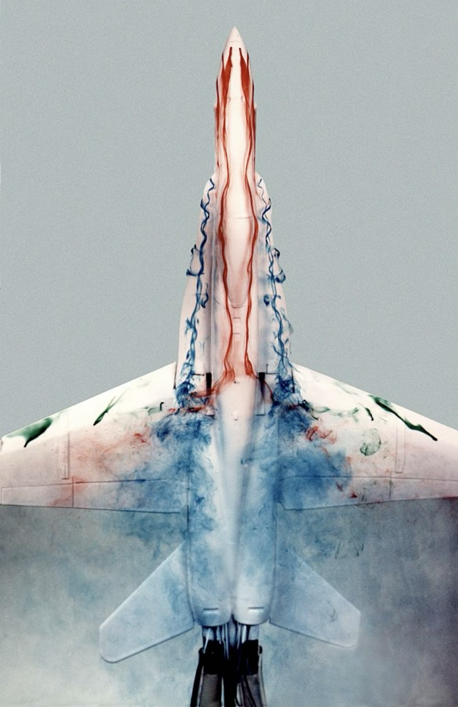{.nostretch fig-align="center" width="350px"}
:::

::::


# Why PIV? 

## Measuring fluid-flow velocity principles

-   To determine the velocity of an object, **distance** and **time** need to be measured (either the distance traveled during a given time or the time needed to travel a given distance). 
-   But, gases as well as pure liquids do not contain moving objects that reveal the velocity of the fluid.
-   Thus, many measurement techniques have been developed, determining the flow velocity **indirectly** by measuring other quantities, such as:
    -   pressure (pressure probes),
    -   rotational speed (wind anemometer),
    -   heat transfer (hot film, hot wire).


## Alternatives to PIV (1/2)

|  | Pitot tube                            | Hot Wire Anemometry                   | Laser Doppler Anemometry                  |
|------------|---------------------------------------|---------------------------------------|-------------------------------------------|
| Sketch     | 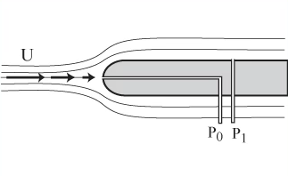{width="250"}   | 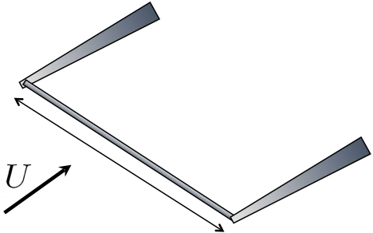{width="200"}          | 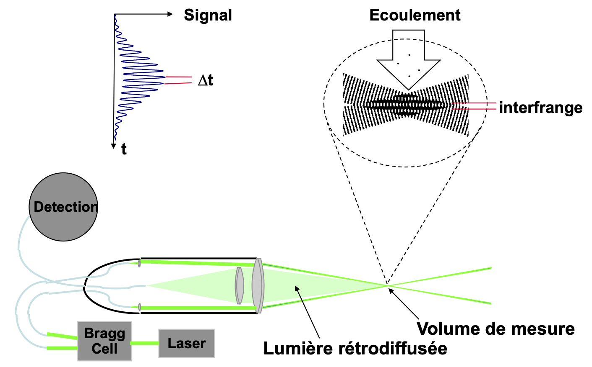{width="250" .lightbox}                          |
| Principle<br> (what is measured)  | Static and dynamic pressures.<br> Bernoulli  | Joule dissipation measurement in a wire    | Interferometric meas. of a Doppler shift on scattering particle |
| Pros       | Easy to use. Cheap (1 k€)          | High time resolution <br> Medium price (10 k€) | Non intrusive. High time resolution. Suited for  several components |
| Cons       | Highly intrusive.<br> Very poor resolution      | Intrusive, fragile. Non linear calibration | Non-regular sampling. High price (50-100 k€). Complex settings |

## Alternatives to PIV (2/2)

:::: {.columns}

::: {.column width="50%"}
1d time resolved signal:
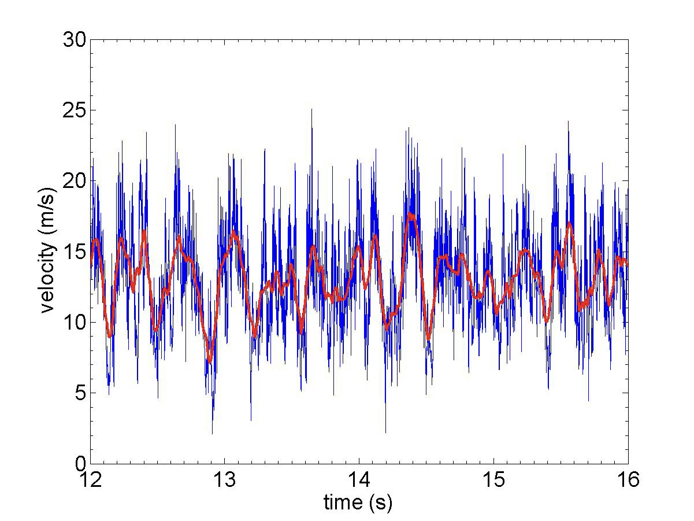{width="600"}

::: {.fragment .fade-in}
Therefore, the structure of an unsteady flow field cannot be obtained by such methods.
:::
:::

::: {.column width="50%"}
::: {.fragment .fade-in}
{width="600"}
:::
:::

::::

## PIV principles (1/2)

:::: {.columns}

::: {.column width="60%"}
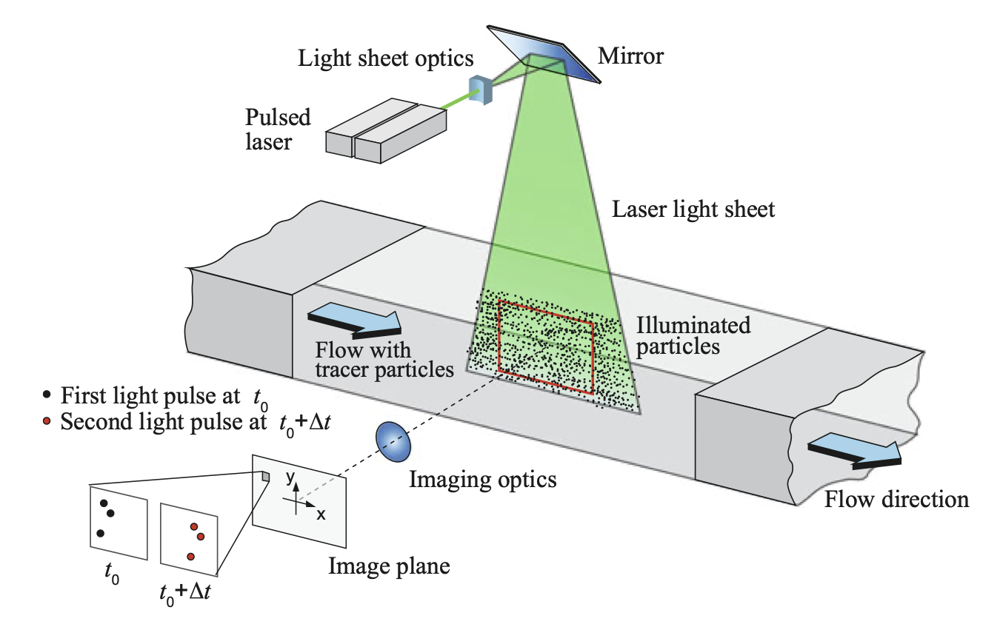{.nostretch fig-align="center" width="600px"}
:::

::: {.column width="40%"}
- **Seeding**: tracer particles are added to the flow.
- **Illumination**: these tracer particles have to be illuminated (in a plane) of the flow at least twice within a short and known time interval.
- **Recording**: the light scattered by the tracer particles on a camera.
- **Calibration**: to determine the relation between the particle image displacement in the image plane and the tracer particle displacement in the flow.
:::

::::


## PIV principles (2/2)

:::: {.columns}

::: {.column width="40%"}
- **Evaluation**: The displacement of the particle images between the light pulses has to be determined through evaluation of the PIV recordings.
- **Post-Processing**: In order to detect and remove invalid measurements and to extract complex flow quantities of interest, sophisticated post-processing is required.
:::

::: {.column width="60%"}
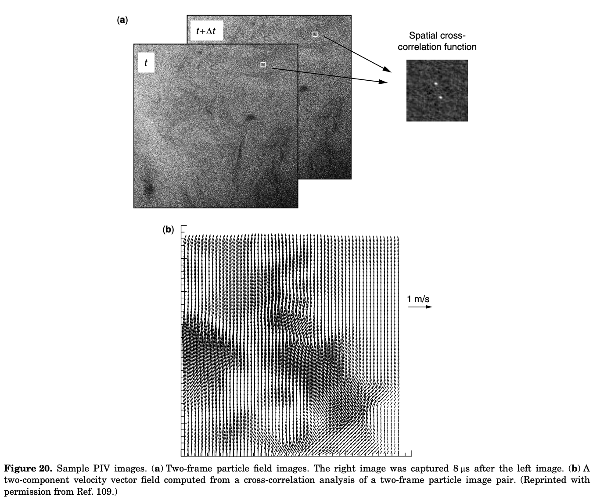{width="800"}
:::

::::


## PIV pros

- The most widely applied velocity imaging technique in fluid mechanics. 
- PIV is a very robust and accurate technique, which in its most common implementation enables the imaging of two components of velocity in a cross-section of the flow.
- PIV measurements are now commonplace and they have been applied in a wide range of gas- and liquid-phase flows, including microfluidics, large-scale wind tunnels, flames, plasmas, and supersonic and hypersonic flows.


## PIV refs

:::: {.columns}

::: {.column width="40%"}
Excellent introductions to PIV can be found in several references:
:::

::: {.column width="60%"}
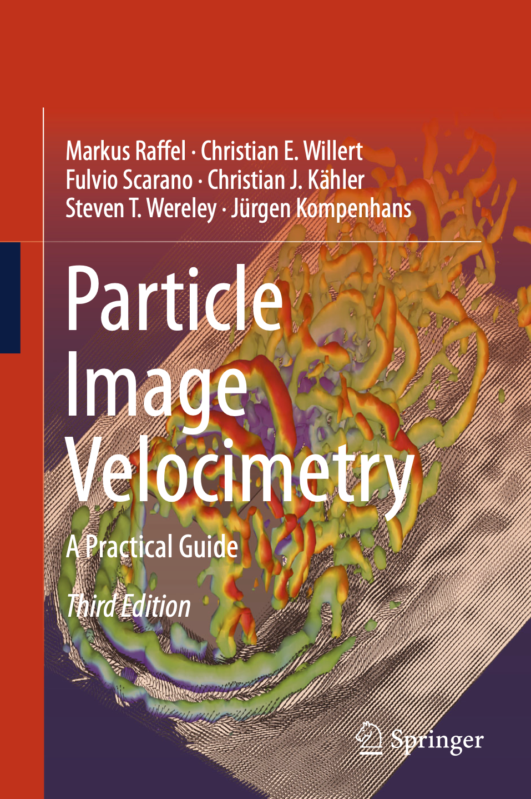{.nostretch fig-align="center" width="350px"}
:::

::::


# Physical and technical background

## Tracer particles

- In contrast to hot wire or pressure probe techniques, PIV is based on the **direct** determination of the 2 fundamental dimensions of the velocity: length and time. 
- On the other hand, the measurement technique is **indirect** as it determines the velocity of tracer particles instead of the velocity of the fluid. 
- Therefore, the interaction of the particles and the surrounding fluid has to be examined in order to avoid significant discrepancies between fluid and particle motion.

## Tracer particles 
### Fluid mech. properties (1/3)

- A primary source of error is the influence of **gravitational forces** on the velocity of the tracer particles, if the densities of the fluid $\rho$ and the tracer particles $\rho_p$ do not match.
- From Stokes’ drag law, assuming spherical particles in a viscous fluid at a very low Reynolds number: $\vec{U}_g = d_p^2 \frac{\rho_p - \rho}{18 \mu} \vec{g}$.
- Therefore, the sedimentation of particles can be avoided if the density of the fluid and particles is identical (**neutral buoyancy**).
- This is easily achieved in liquid flows, but not in gas flows. Therefore, the particle diameter must be chosen sufficiently small to minimize the settling velocity of the particles. 

## Tracer particles 
### Fluid mech. properties (2/3)

:::: {.columns}

::: {.column width="70%"}
- Particle frequency response: $\frac{d}{dt}U_p = -18 \frac{\nu}{d_p^2}\frac{U_p - U_f}{\rho_p / \rho_f}$
$$ \Rightarrow U_p(t) = U_f \left(1-\exp \left( t / \tau_p \right )\right)$$
with $\tau_{\rm p} = d_{\rm p}^2 \frac{\rho_{\rm p}}{18 \mu}$, relaxation time scale of the particle.
:::

::: {.column width="30%"}
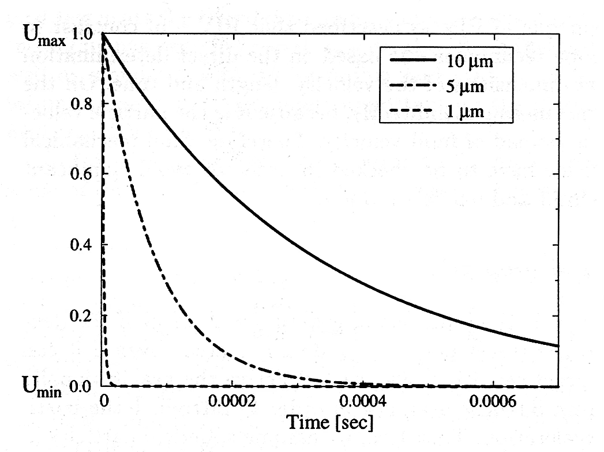{width="300"}
:::

::::

- A convenient measure for the tendency of particles to attain velocity equilibrium with the fluid is given by the Stokes number
$$ St = \frac{\tau_{\rm p}}{\tau_{\rm f}}$$ 
where $\tau_f$ stands for the characteristic time scale of the flow (refers to velocity fluctuations along the particle trajectory).
- A value of the Stokes number below $10^{-1}$ yields an acceptable flow tracing accuracy.


## Tracer particles
### Fluid mech. properties (3/3)

| |  | Diameter ($\mu m$) | Relative density | Response time $\tau_p$ ($\mu s$)|
|---- |-----------------------|-----------------------|-----------------------|-----------------------|
| Water | Hollow glass spheres  | 10 | 1.05 | 0.5 |
|  Water | Aluminium powder | 3 | 2.7 | 0.9 | 
| Air | Oil dropplets | 1 | 920 | 0.3 |
| Air| SiO$_2$ beads | 0.8 | 2600 | 5 |
| Air | Inflated bubbles | 300 | 1 | 0.3 |


## Tracer particles generation 

:::: {.columns}

::: {.column width="50%"}
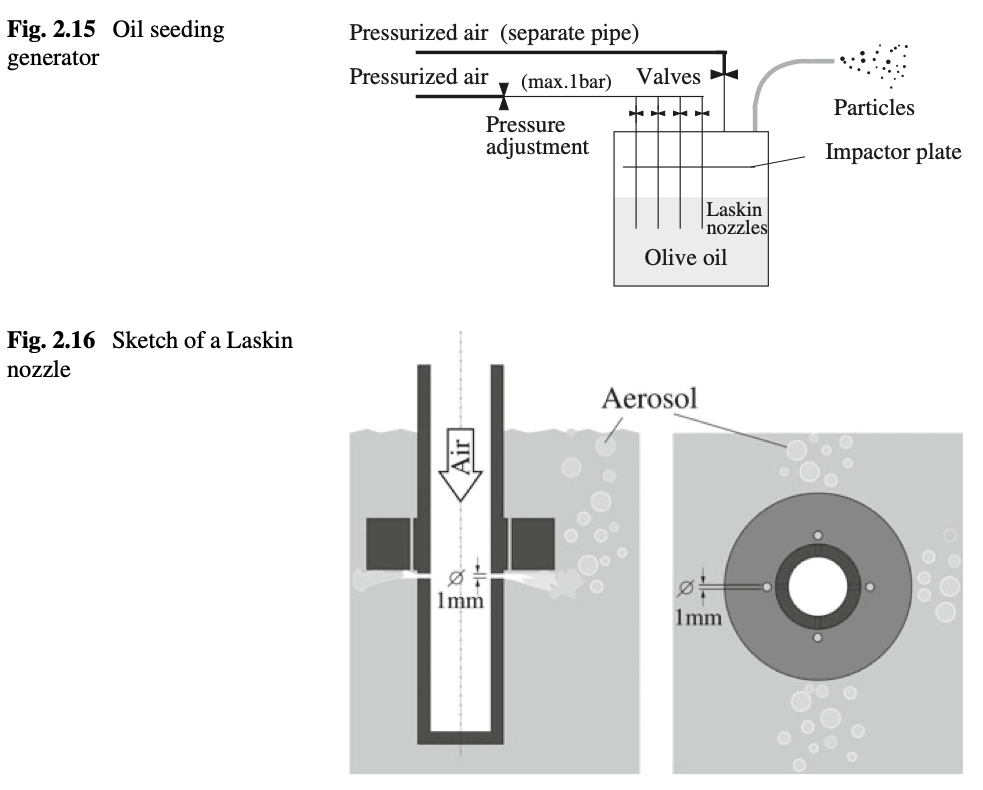{width="500"}
:::

::: {.column width="50%"}
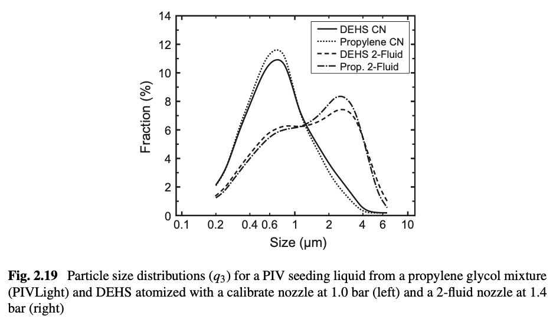{width="700"}
:::

::::

## Light scattering

:::: {.columns}

::: {.column width="60%"}
PIV image intensity and contrast $\propto$ scattered light power: selecting suitable scattering particles is usually more effective and cost-efficient than increasing laser (illumination) power.

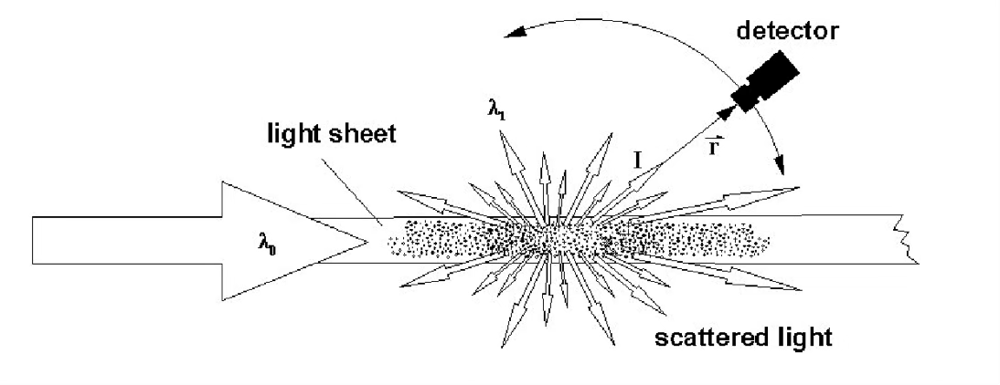{width="500"}
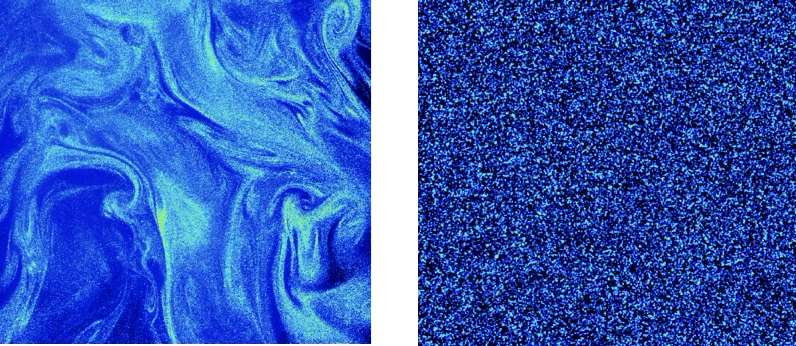{width="700"}
:::

::: {.column width="40%"}
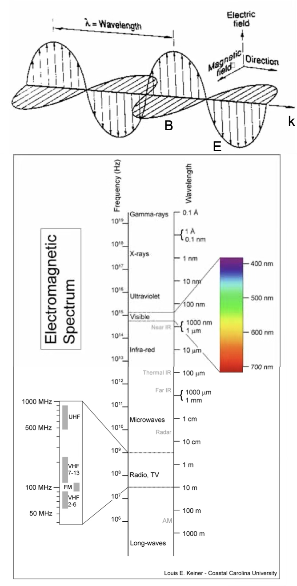{.nostretch fig-align="center" width="300px"}
:::

::::


## Light scattering

For spherical particles with diameters $d_p$ larger than the wavelength of the incident light $\lambda$, **Mie’s scattering theory** holds.

:::: {.columns}

::: {.column width="50%"}
Maximum light diffused at 0°

| Important parameters:
|   -- Particle type/shape/size
|   -- Refraction index
|   -- Nature of the environment
:::

::: {.column width="50%"}
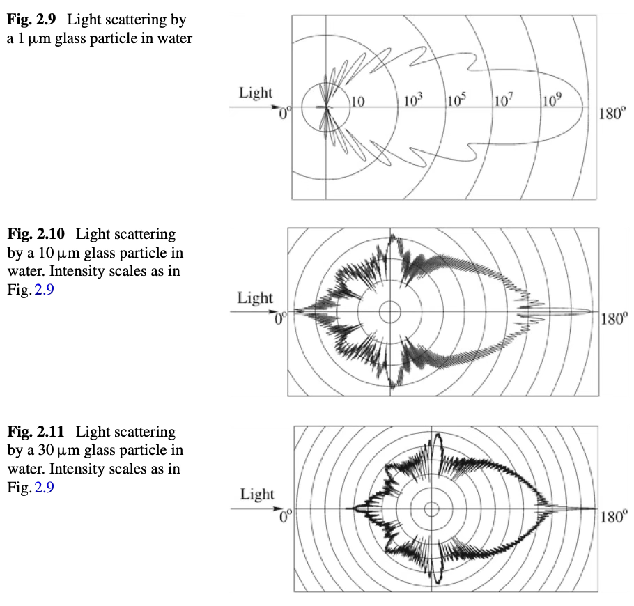{width="700"}
:::

::::


## Illumination sheet

Use of spherical and cylindrical lenses

| Important parameters:
|   -- Cylindrical lens curvature and concavity (F2)
|   -- Focal length of the spherical lens (F1)
|   -- Divergence and diameter of the laser beam

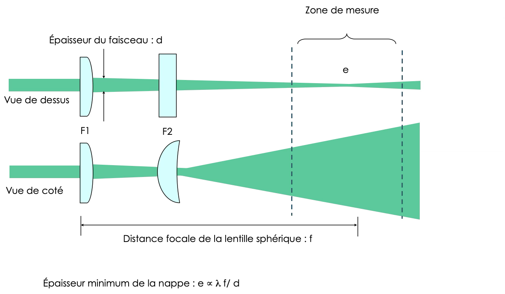{.nostretch fig-align="center" width="700px"}


## Image recording

See B. Radisson’s lecture.

## Complete setup overview

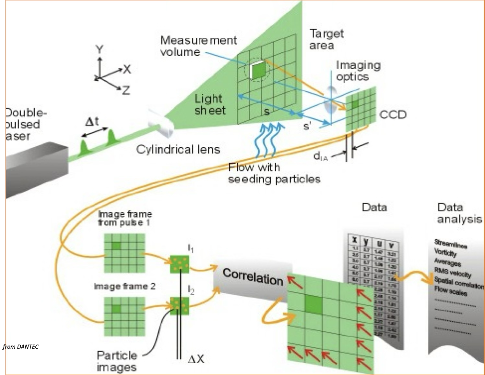{fig-align="center" width="700"}

## Resolution requirements in fluid flows (1/2)

- One of the major difficulties in flow imaging is achieving adequate spatial and temporal resolution. This is particularly the case when flows are turbulent, if it is desired to resolve the smallest scales at which fluctuations occur.
- Laminar flows pose less stringent requirements on resolution, compared to turbulent flows. In many laminar shear flows including boundary layers, pipe flows, wakes, jets, and mixing layers, the maximum gradient is the same order of magnitude as the overall gradient,
$$\left(\frac{\partial U}{\partial y} \right)_{\rm max} \approx \frac{\Delta U}{\delta}$$
where $\Delta U$ is the characteristic velocity difference, $\delta$ is the local width of the shear flow.

## Resolution requirements in fluid flows (2/2)

- Turbulent flows have substantially more severe resolution requirements than laminar flows, owing to the much larger gradients that occur at the smallest scales of turbulence. 
- In turbulent flows, the spatial fluctuations range in scale from the largest physical dimension of the flow (e.g., the local width of the boundary layer or jet) to the scale at which diffusion acts to remove all gradients. 
- The largest scales are often called the ‘‘outer scales,’’ whereas the smallest scales are the ‘‘inner’’ or dissipation scales because these are the scales at which the energy of fluctuations, whether kinetic or scalar, is dissipated.
- In classical turbulence theory, the kinetic energy dissipation scale is the Kolmogorov scale
$$\eta \equiv \left( \frac{\nu ^3}{\epsilon} \right)^{1/4}.$$
- Using scaling arguments, the Kolmogorov scale can also be related to outer scale variables through the relationship, $\eta \propto Re^{-3/4}$.

## Summary

Developping a PIV setup is a seek for a compromise regarding, 

:::: {.columns}

::: {.column width="50%"}
| Reduced inertia of the seeding particles:
|   -- Neutrally buoyant
|   -- As small as possible

| High visibility:
|   -- Good light scattering
|   -- Large enough

Air vs water

Application
:::

::: {.column width="50%"}
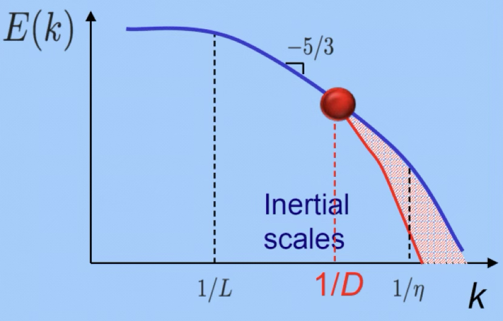{width="700"}
:::

::::


# Image evaluation methods


## Frame 1 {background="#43464B" background-image="images/piv_frame1.png"}

## Frame 2 {background="#43464B" background-image="images/piv_frame2.png"}


## Objective

Estimate a **velocity-field** from a couple of **grayscale particle images**, i.e. find $\vec{V}(\vec{x},t)$ from $I(\vec{x},t,t+\Delta t)$, $I \in [0,255]$.

- Ideally, a high data density is preferred on the PIV vector fields, particularly when significant spatial flow variations must be resolved or when comparing experimental data with numerical results. 
- This requires a medium concentration of the images of the tracer particles in the PIV recording.
- Medium image concentration is characterized by the fact that matching pairs of particle images – due to subsequent illuminations – cannot be detected by visual inspection. 
- Hence, statistical approaches were developed.


## From $I(\vec{x},t,t+\Delta t)$, $I \in [0,255]$ {auto-animate="true"}

``` {python}
#| echo: true
# import the standard numerical and plotting packages
import numpy as np
import matplotlib.pyplot as plt
# import what is necessary from OpenPIV
from openpiv import tools

# load the images
a = tools.imread("./images/B005_1.tif")
b = tools.imread("./images/B005_2.tif")
```


## From $I(\vec{x},t,t+\Delta t)$, $I \in [0,255]$ {auto-animate="true"}

``` {python}
#| echo: true
#| output-location: fragment
# import the standard numerical and plotting packages
import numpy as np
import matplotlib.pyplot as plt
# import what is necessary from OpenPIV
from openpiv import tools

# load the images
a = tools.imread("./images/B005_1.tif")
b = tools.imread("./images/B005_2.tif")

fig, axs = plt.subplots(1, 2, figsize=(9, 4))
img = axs[0].imshow(a, vmin=0, vmax=100, cmap=plt.cm.gray)
axs[0].set_title('frame A')
img = axs[1].imshow(b, vmin=0, vmax=100, cmap=plt.cm.gray)
axs[1].set_title('frame B')
cbar = fig.add_axes([0.95, 0.1, 0.03, 0.8])
fig.colorbar(img, cax=cbar)
plt.show()
```

## Windowing {auto-animate="true"}

Let's focus on small portions of the images:

``` {python}
#| echo: true
#| output-location: fragment
win_size = 32
a_win = a[:win_size, :win_size].copy()
b_win = b[:win_size, :win_size].copy()

fig, axs = plt.subplots(1, 2, figsize=(9, 4))
img = axs[0].imshow(a_win, vmin=0, vmax=100, cmap=plt.cm.gray)
axs[0].set_title('IA')
img = axs[1].imshow(b_win, vmin=0, vmax=100, cmap=plt.cm.gray)
axs[1].set_title('IB')
cbar = fig.add_axes([0.95, 0.1, 0.03, 0.8])
fig.colorbar(img, cax=cbar)
plt.show()
```
The movement of individual particles from frame A to frame B is untrackable by "hand".

## Shifting {auto-animate="true"}

We could then try to shift the window IA by some pixels along the horizontal and/or vertical directions 

``` {python}
#| echo: true
#| output-location: fragment
#| code-line-numbers: "2,4,6"
fig, axs = plt.subplots(1, 3, figsize=(9, 4))
img = axs[0].imshow(b_win - a_win, cmap=plt.cm.gray)
axs[0].set_title("IB - IA(shift=0)")
img = axs[1].imshow(b_win - np.roll(a_win, (1, 0), axis=(0, 1)), cmap=plt.cm.gray)
axs[1].set_title("IB - IA(shift=1 pxl)")
img = axs[2].imshow(b_win - np.roll(a_win, (2, 0), axis=(0, 1)), cmap=plt.cm.gray)
axs[2].set_title("IB - IA(shift=2 pxl)")
cbar = fig.add_axes([0.95, 0.1, 0.03, 0.8])
fig.colorbar(img, cax=cbar)
plt.show()
```

## Optimal matching?  {auto-animate="true"}

Let’s try to find the best shift algorithmically: shift and calculate the sum of squared differences, the minimum of which should be the best shift.

``` {python}
#| echo: true
#| output-location: fragment
#| code-line-numbers: "|16"
def match_template(img, template, maxroll=8):
    # img: input image to compare
    # template: image to match against
    # maxroll: max nbr of pxl to shift in each dir. Default value is 8.
    best_dist = np.inf
    best_shift = (-1, -1)
    for y in range(-maxroll,maxroll):
        for x in range(-maxroll,maxroll):
            # calculate Euclidean distance
            dist = np.sqrt(np.sum((img - np.roll(template, (y, x), axis=(0, 1))) ** 2))
            if dist < best_dist:
                best_dist = dist
                best_shift = (y, x)
    return (best_dist, best_shift)
# Let’s check that it works by manually shifting the same image (IA):
match_template(np.roll(a_win, (2, 0), axis=(0, 1)), a_win)
```


## Optimal matching?  {auto-animate="true"}

Let’s try to find the best shift algorithmically: shift and calculate the sum of squared differences, the minimum of which should be the best shift.

``` {python}
#| echo: true
#| output-location: fragment
# Let’s try it on the two sub-windows
match_template(b_win, a_win)
```

::: {.fragment .fade-in}
Well, this is not the true displacement, but it gives a hint.

The problem is that shifting each image and repeating the loop many times is impractical.
:::

## Optimal matching? {auto-animate="true"}

Let's use a different matching principle, based on the  **cross-correlation**:

:::: {.columns}
::: {.column width="50%"}
$$R_{II}(x,y) = \sum_{i=-K}^K \sum_{j=-L}^L I(i,j) I'(i+x,j+y)$$

- $I(x,y) =$ Pixel grayscale $(i,j)$ of the 1st image (instant $t$)
- $I'(x,y) =$ Pixel grayscale $(i,j)$ of the 2nd image (instant $t+\Delta t$)
- $2K$, $2L$ = Dimension of the analysis area (mesh).

This is statistical information. We do not look for particle-to-particle speed!
:::

::: {.column width="50%"}
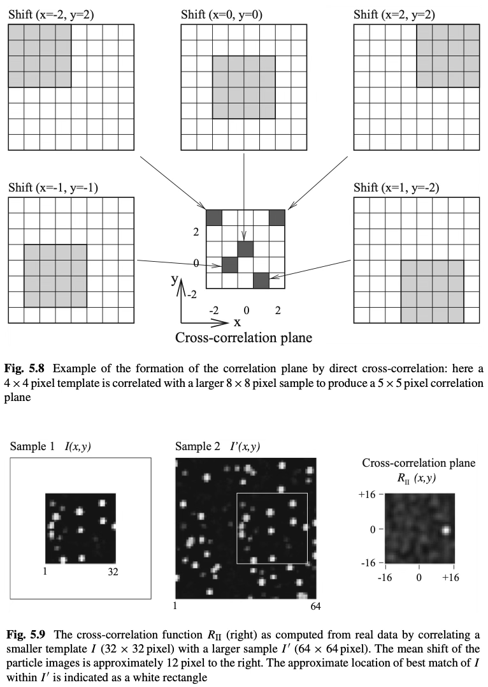{fig-align="center" width="400"}
:::

::::

## CC interrogation technic

Direct calculation: very long! : $2M^2N^2$ operations $\Rightarrow$ Calculation of the correlation function by FFT: $2N^2\log_2N$ (if $N=M$).

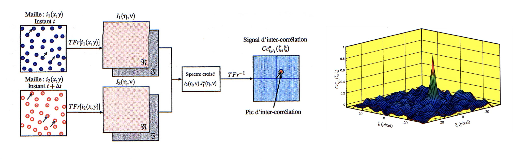{width="700"}

## CC interrogation technic 

CC is an efficient computational algorithm to find out the right shift.

``` {python}
#| echo: true
#| output-location: fragment
# import the required package
from scipy.signal import correlate

cross_corr = correlate(b_win - b_win.mean(), a_win - a_win.mean(), method="fft")
# let's see what the cross-correlation looks like
Y, X = np.meshgrid(np.arange(cross_corr.shape[0]), np.arange(cross_corr.shape[1]))
fig = plt.figure()
ax = fig.add_subplot(projection="3d")
ax.plot_surface(Y, X, cross_corr, cmap='jet', linewidth=0.2)
plt.title("Correlation map — peak is the most probable shift")
plt.show()
```

## CC interrogation technic {.scrollable}

We can get the first velocity field by repeating this analysis for all windows. 

``` {python}
#| echo: true
#| output-location: fragment
def vel_field(curr_frame, next_frame, win_size):
    ys = np.arange(0, curr_frame.shape[0], win_size)
    xs = np.arange(0, curr_frame.shape[1], win_size)
    dys = np.zeros((len(ys), len(xs)))
    dxs = np.zeros((len(ys), len(xs)))
    for iy, y in enumerate(ys):
        for ix, x in enumerate(xs):
            int_win = curr_frame[y : y + win_size, x : x + win_size]
            search_win = next_frame[y : y + win_size, x : x + win_size]
            cross_corr = correlate(
                search_win - search_win.mean(), int_win - int_win.mean(), method="fft"
            )
            dys[iy, ix], dxs[iy, ix] = (
                np.unravel_index(np.argmax(cross_corr), cross_corr.shape)
                - np.array([win_size, win_size])
                + 1
            )
    # locate velocity vectors from the center of each window
    ys = ys + win_size / 2
    xs = xs + win_size / 2
    return xs, ys, dxs, dys

xs, ys, dxs, dys = vel_field(a, b, 32)
norm_drs = np.sqrt(dxs ** 2 + dys ** 2)

fig, ax = plt.subplots(figsize=(9, 4))
ax.quiver(
    xs,
    ys[::-1],
    dxs,
    -dys,
    norm_drs,
    cmap="plasma",
    angles="xy",
    scale_units="xy",
    scale=0.25,
)
ax.set_aspect("equal")
plt.show()
```


## CC interrogation technic

Let's have a look back at the CC map:

:::: {.columns}
::: {.column width="50%"}
``` {python}
#| echo: true
#| output-location: fragment
plt.imshow(cross_corr, cmap=plt.cm.gray)
y, x = np.unravel_index(cross_corr.argmax(), cross_corr.shape)
print(f"{y=}, {x=}")
plt.show()
```
:::

::: {.column width="50%"}

::: {.fragment .fade-in}
- The information is discrete (pxl)! Very high uncertainty for displacements close to 1 pxl

- Sub-pixel interpolation of the correlation peak (Gaussian, parabolic, etc.) over 3, 5 or 7 pxls $\Rightarrow$ theoretical accuracy 0.01 pxl.

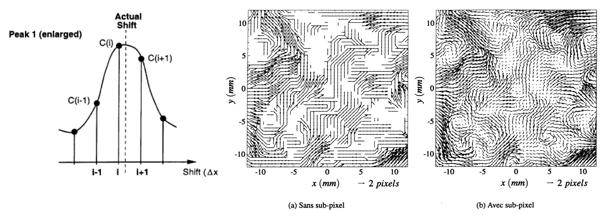{width="900"}
:::

:::

::::


## CC interrogation technic
### errors

:::: {.columns}
::: {.column width="50%"}
- The interpolation of correlation peaks causes a bias towards integer values displacements (Peak locking effect)
- This effect increases when the particle image size < 2 pixels
- Solutions to correct this effect: choice of the interpolation function, iterative PIV, etc.
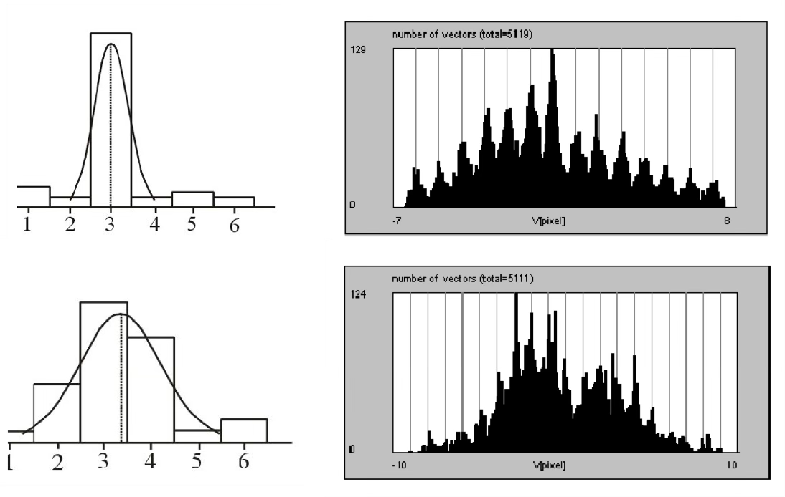{width="700"}
:::

::: {.column width="50%"}

::: {.fragment .fade-in}
| Particle size on image results from:
|   -- Actual particle size
|   -- Particle brigthness
|   -- Sensor pixel size
|   -- Focus

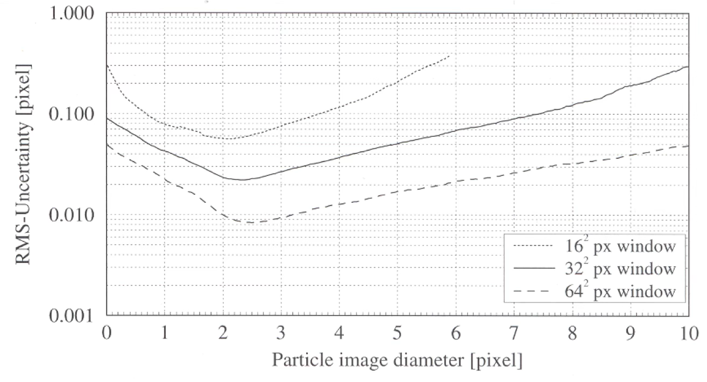{width="700"}

:::

:::

::::


## Parameters
### Taking good quality images is an art!


:::: {.columns}
::: {.column width="50%"}

::: {.fragment .fade-in}
- Homogeneous, regular tracer density $\rightarrow$ correlation relevance
:::

::: {.fragment .fade-in}
- Particle image size (ideal: ~3/4 pixels): Detectability / Pixel locking
:::

::: {.fragment .fade-in}
- No saturation of particle images on the CCD sensor
:::

::: {.fragment .fade-in}
- No reflection, background noise,...
:::

:::

::: {.column width="50%"}

::: {.fragment .fade-in}
- Gaussian laser beams
:::

::: {.fragment .fade-in}
- Superimposed laser sheets, ideal thickness ~ 500μm
:::

::: {.fragment .fade-in}
- Time between pulses:
In plane displacement => resolution 
Out of plane displacement => lost particles
:::

:::

::::

::: {.fragment .fade-in}
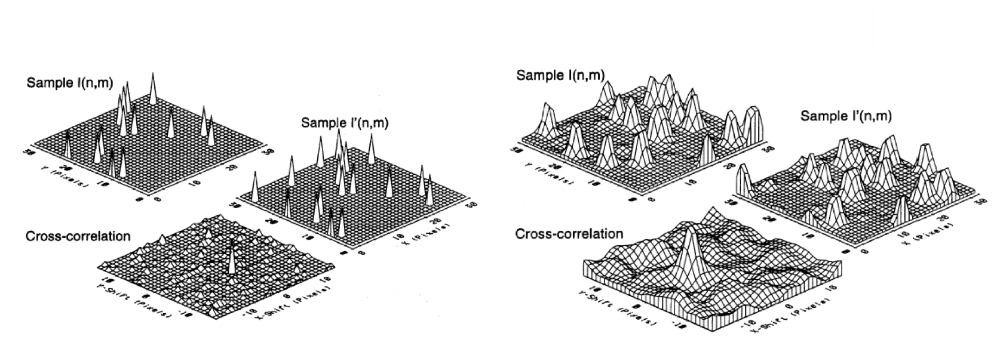{width="1000"}
:::


## Parameters

Correlation coefficient for different displacements, i.e. different time between pulses

::: {.fragment .fade-in}
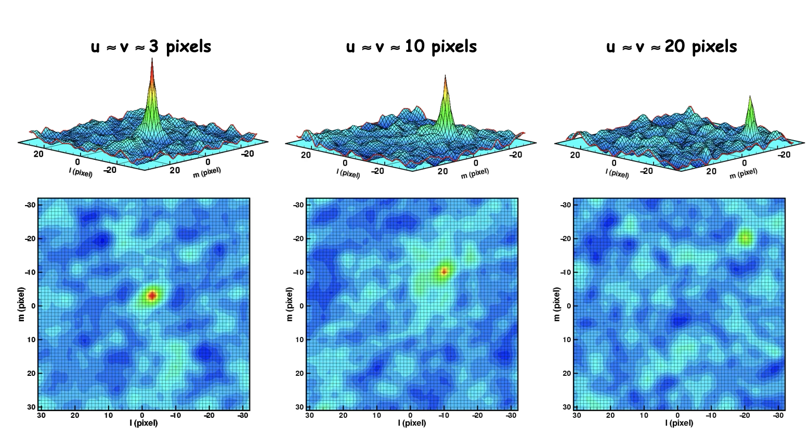{width="1000"}
:::

## Spatial resolution

Typical mesh sizes: $32 \times 32$, $64 \times 64$, $128 \times 128$ pixel $^2$

Typical pixel size: $0.1$ mm to $1$ mm

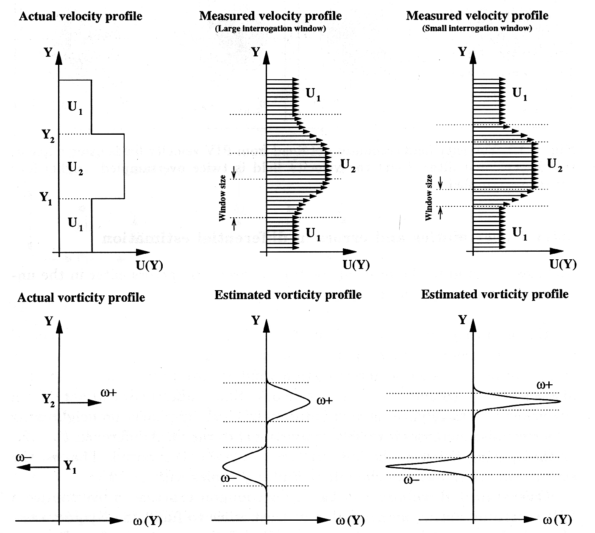{width="1000"}

## Spatial resolution

Overlaping of the interrogation windows: typically 50%, 75%

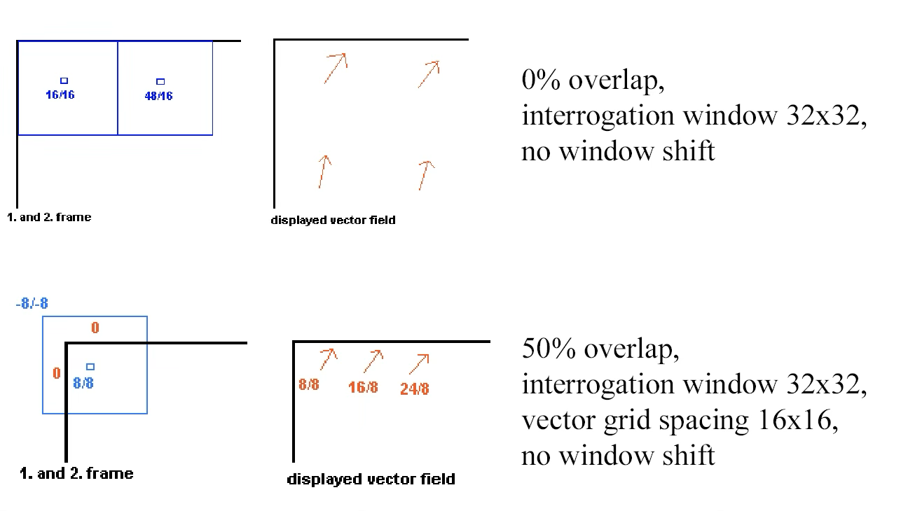{width="1000"}

## Spatial resolution

If strong gradients

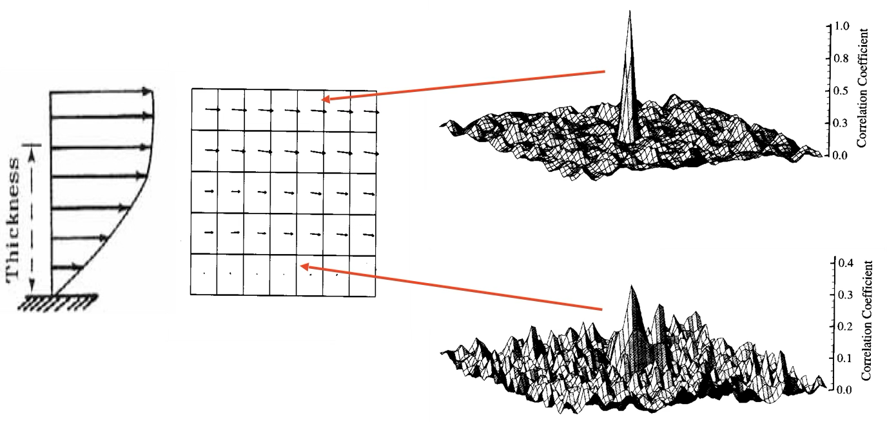{width="1000"}

$\rightarrow$ towards multi-pass


## Multi-pass

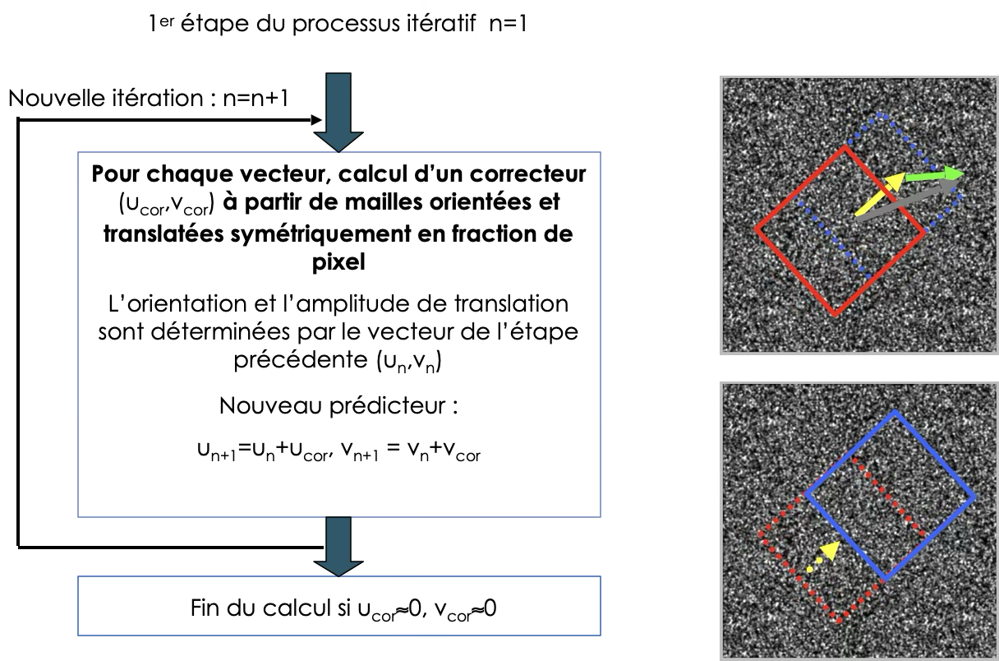{width="1000"}


## Validation procedure

Quality factor (signal-to-noise ratio): 

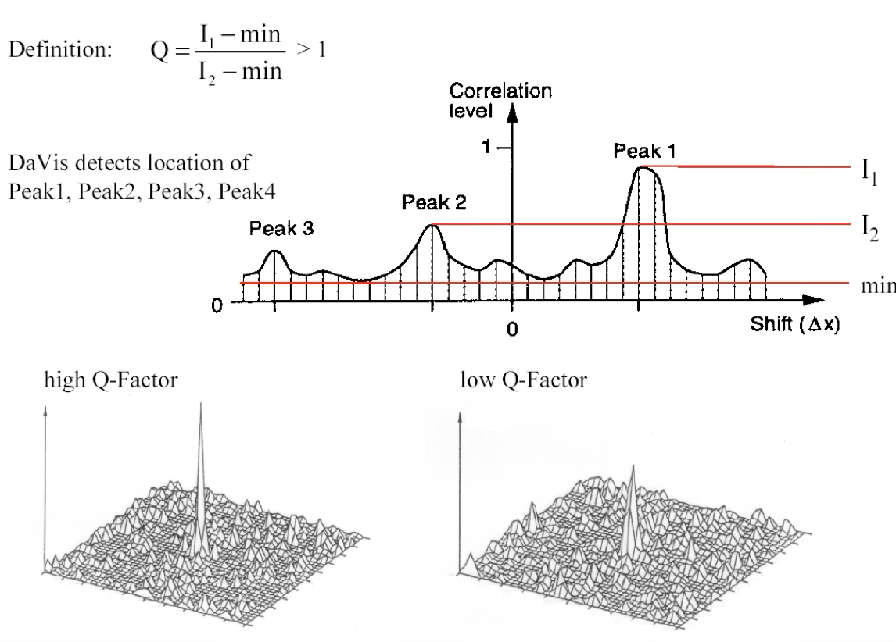{fig-align="center" width="1000"}

## Validation procedure

:::: {.columns}
::: {.column width="40%"}

- Comparison of vectors with their $k \equiv [i-N:i+N,j-N:j+N]$ neighbors: suppression/replacement if, e.g.,
$$V_{ij} > \overline{V_k} \pm K \times {\rm RMS(neighbors)}$$ 

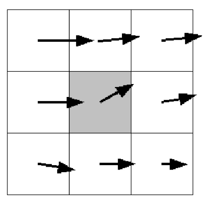{fig-align="center" width="200"}
:::

::: {.column width="10%"}
::: 

::: {.column width="50%"}
::: {.fragment .fade-in}

- Spatial filtering (vectors interpolation): Post-processing is not an artistic creation! It is necessary to remove the noise as much as possible without removing the signal

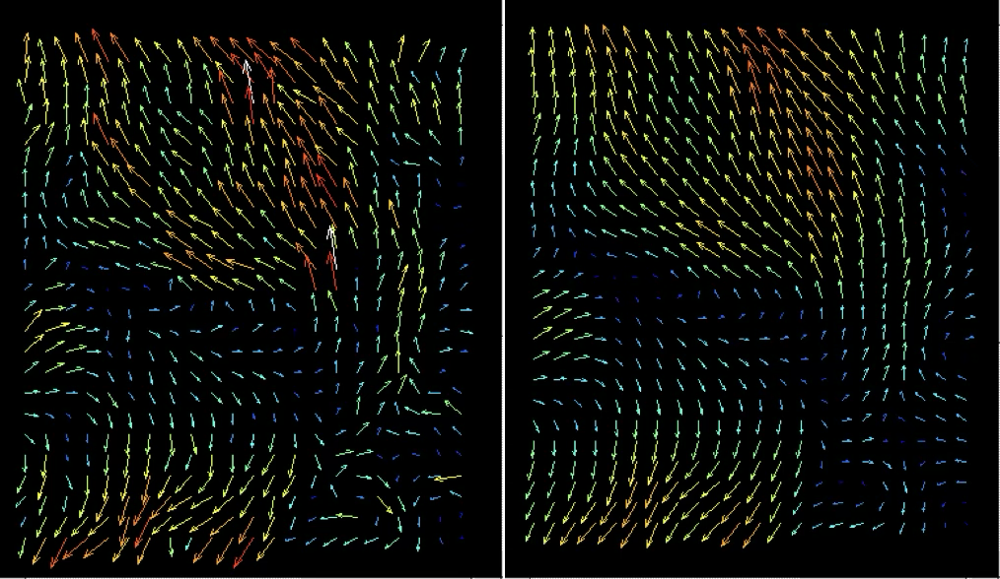{width="500"}
:::
:::
::::


## And More...

-   [Footer & Logo](https://quarto.org/docs/presentations/revealjs/#footer-logo) (optionally specify custom footer per-slide or hide global footer)
-   [Multiplex](https://quarto.org/docs/presentations/revealjs/presenting.html#multiplex) (allows your audience to follow the slides of the presentation you are controlling on their own phone, tablet or laptop).

::: footer
Learn more: [Quarto Presentations](https://quarto.org/docs/presentations/revealjs/)
:::